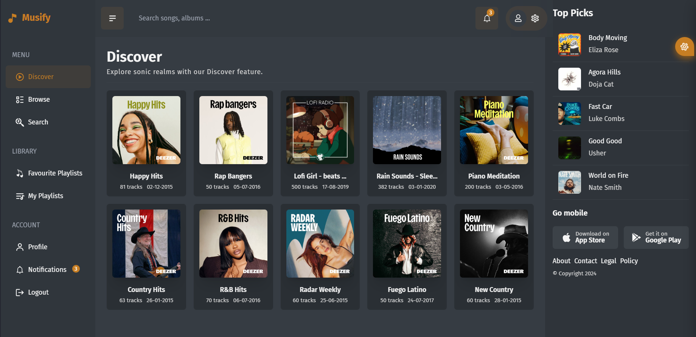

# Musify App

Step into the world of Musify, a state-of-the-art music platform crafted using ReactJs and Firebase. Through seamless integration with the Deezer music API, Musify offers an immersive music experience like no other. <br />
Beyond offering an extensive library of songs, Musify elevates your music exploration with its intuitive interface and a plethora of features designed to empower your musical journey.

## Table of Contents

- [Description](#description)
- [Features](#features)
- [Screenshots](#screenshots)
- [Demo app](#demo-app)
- [Tech Stack](#tech-stack)
- [Installation](#installation)
  - [Firebase Setup](#firebase-setup)
- [Usage](#usage)
- [Additional Information](#additional-information)

## Description

Musify redefines the way you enjoy music by offering an enhanced listening experience. Featuring a sleek and user-friendly interface, users can effortlessly log in, explore, and indulge in their preferred tracks. Powered by ReactJs for dynamic frontend capabilities and Firebase for robust backend support, Musify ensures a seamless music journey. <br />
Experience uninterrupted music playback with Musify's array of features, including user authentication, intuitive song controls, comprehensive search options, playlist customization, and a personalized theme selector. <br />
The application was created in order to replace all analogues. Such as Spotify, which is no longer available in our country; SoundCloud, which does not have an excellent interface; YandexMusic, which does not always correctly display customizable collections, and frankly it is expensive

## Features

1. **User Authentication:**

   - Sign in, sign up, and password reset functionalities.

2. **Playback Controls:**

   - Play, pause, skip, and loop songs with ease.

3. **Volume Control:**

   - Adjust volume, mute/unmute while enjoying your music.

4. **Search Functionality:**

   - Search for songs by song name, artist name, or album name.

5. **Like Songs:**

   - Like your favorite songs to build a personalized collection.

6. **Playlist Creation:**

   - Create and manage playlists tailored to your taste.

7. **Song Details:**

   - Explore song details, including cover image, singer, and album information.

8. **Persistent Music Player:**

   - A music player component accessible across all pages, allowing uninterrupted music playback.

9. **Cross-Page Playback:**

   - Keep the music playing while navigating through different sections of the app.

10. **Theme Switcher:**
    - Fully customizable theme switcher to personalize your visual experience.

## Screenshots



## Demo app

You can see demo app here [here](add-demo-url-here).

## Tech Stack

- **Frontend:**

  - React
  - Vite
  - React Query
  - Tailwind

- **Backend:**

  - Firebase (Authentication, Firestore, Storage)

- **API Integration:**
  - Deezer Music API

## Installation

To run Musify locally do:

1. Install dependencies:

   ```bash
   yarn
   ```

2. Launch dev server:

   ```bash
   yarn dev
   ```

3. Create a new .env file and add the necessary firebase configurations.

   ```
   VITE_PUBLIC_FIREBASE_API_KEY={apiKey}
   VITE_PUBLIC_FIREBASE_AUTH_DOMAIN={authDomain}
   VITE_PUBLIC_FIREBASE_PROJECT_ID={projectId}
   VITE_PUBLIC_FIREBASE_STORAGE_BUCKET={storageBucket}
   ```
